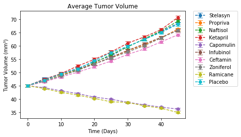
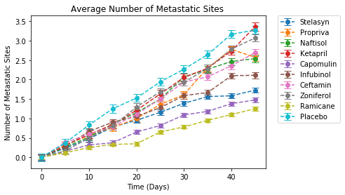
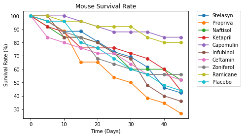
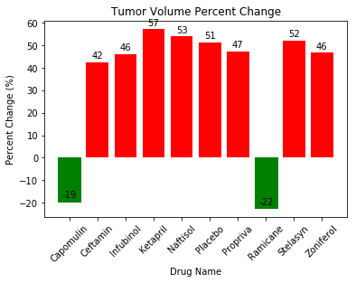

```python
import matplotlib.pyplot as plt
import numpy as np
import pandas as pd
from scipy.stats import sem

trials = pd.read_csv("Instructions/Pymaceuticals/raw_data/clinicaltrial_data.csv")
mice= pd.read_csv("Instructions/Pymaceuticals/raw_data/mouse_drug_data.csv")

df = mice.merge(trials, on="Mouse ID")
df.head()
```


<div>
<style scoped>
    .dataframe tbody tr th:only-of-type {
        vertical-align: middle;
    }

    .dataframe tbody tr th {
        vertical-align: top;
    }

    .dataframe thead th {
        text-align: right;
    }
</style>
<table border="1" class="dataframe">
  <thead>
    <tr style="text-align: right;">
      <th></th>
      <th>Mouse ID</th>
      <th>Drug</th>
      <th>Timepoint</th>
      <th>Tumor Volume (mm3)</th>
      <th>Metastatic Sites</th>
    </tr>
  </thead>
  <tbody>
    <tr>
      <th>0</th>
      <td>f234</td>
      <td>Stelasyn</td>
      <td>0</td>
      <td>45.000000</td>
      <td>0</td>
    </tr>
    <tr>
      <th>1</th>
      <td>f234</td>
      <td>Stelasyn</td>
      <td>5</td>
      <td>47.313491</td>
      <td>0</td>
    </tr>
    <tr>
      <th>2</th>
      <td>f234</td>
      <td>Stelasyn</td>
      <td>10</td>
      <td>47.904324</td>
      <td>0</td>
    </tr>
    <tr>
      <th>3</th>
      <td>f234</td>
      <td>Stelasyn</td>
      <td>15</td>
      <td>48.735197</td>
      <td>1</td>
    </tr>
    <tr>
      <th>4</th>
      <td>f234</td>
      <td>Stelasyn</td>
      <td>20</td>
      <td>51.112713</td>
      <td>2</td>
    </tr>
  </tbody>
</table>
</div>


```python
stelasyn = df[df["Drug"] == "Stelasyn"]
propriva = df[df["Drug"] == "Propriva"]
naftisol = df[df["Drug"] == "Naftisol"]
ketapril = df[df["Drug"] == "Ketapril"]
capomulin = df[df["Drug"] == "Capomulin"]
infubinol = df[df["Drug"] == "Infubinol"]
ceftamin = df[df["Drug"] == "Ceftamin"]
zoniferol = df[df["Drug"] == "Zoniferol"]
ramicane = df[df["Drug"] == "Ramicane"]
placebo = df[df["Drug"] == "Placebo"]

s_time_means = stelasyn.groupby("Timepoint").mean()
pr_time_means = propriva.groupby("Timepoint").mean()
n_time_means = naftisol.groupby("Timepoint").mean()
k_time_means = ketapril.groupby("Timepoint").mean()
ca_time_means = capomulin.groupby("Timepoint").mean()
i_time_means = infubinol.groupby("Timepoint").mean()
ce_time_means = ceftamin.groupby("Timepoint").mean()
z_time_means = zoniferol.groupby("Timepoint").mean()
r_time_means = ramicane.groupby("Timepoint").mean()
pl_time_means = placebo.groupby("Timepoint").mean()

timepoints = df["Timepoint"].unique()

s_error = sem(stelasyn["Tumor Volume (mm3)"])
pr_error = sem(propriva["Tumor Volume (mm3)"])
n_error = sem(naftisol["Tumor Volume (mm3)"])
k_error = sem(ketapril["Tumor Volume (mm3)"])
ca_error = sem(capomulin["Tumor Volume (mm3)"])
i_error = sem(infubinol["Tumor Volume (mm3)"])
ce_error = sem(ceftamin["Tumor Volume (mm3)"])
z_error = sem(zoniferol["Tumor Volume (mm3)"])
r_error = sem(ramicane["Tumor Volume (mm3)"])
pl_error = sem(placebo["Tumor Volume (mm3)"])

s_tum_means = s_time_means["Tumor Volume (mm3)"]
pr_tum_means = pr_time_means["Tumor Volume (mm3)"]
n_tum_means = n_time_means["Tumor Volume (mm3)"]
k_tum_means = k_time_means["Tumor Volume (mm3)"]
ca_tum_means = ca_time_means["Tumor Volume (mm3)"]
i_tum_means = i_time_means["Tumor Volume (mm3)"]
ce_tum_means = ce_time_means["Tumor Volume (mm3)"]
z_tum_means = z_time_means["Tumor Volume (mm3)"]
r_tum_means = r_time_means["Tumor Volume (mm3)"]
pl_tum_means = pl_time_means["Tumor Volume (mm3)"]

fig, ax = plt.subplots()

ax.errorbar(timepoints, s_tum_means, s_error, capsize=5, fmt="--o", label="Stelasyn")
ax.errorbar(timepoints, pr_tum_means, pr_error, capsize=5, fmt="--o", label="Propriva")
ax.errorbar(timepoints, n_tum_means, n_error, capsize=5, fmt="--o", label="Naftisol")
ax.errorbar(timepoints, k_tum_means, k_error, capsize=5, fmt="--o", label="Ketapril")
ax.errorbar(timepoints, ca_tum_means, ca_error, capsize=5, fmt="--o", label="Capomulin")
ax.errorbar(timepoints, i_tum_means, i_error, capsize=5, fmt="--o", label="Infubinol")
ax.errorbar(timepoints, ce_tum_means, ce_error, capsize=5, fmt="--o", label="Ceftamin")
ax.errorbar(timepoints, z_tum_means, z_error, capsize=5, fmt="--o", label="Zoniferol")
ax.errorbar(timepoints, r_tum_means, r_error, capsize=5, fmt="--o", label="Ramicane")
ax.errorbar(timepoints, pl_tum_means, pl_error, capsize=5, fmt="--o", label="Placebo")

plt.legend(bbox_to_anchor=(1.05, 1), loc=2, borderaxespad=0.)

plt.title("Average Tumor Volume")
plt.xlabel("Time (Days)")
plt.ylabel("Tumor Volume (mm\u00b3)")

plt.show()
```





```python
s_error = sem(stelasyn["Metastatic Sites"])
pr_error = sem(propriva["Metastatic Sites"])
n_error = sem(naftisol["Metastatic Sites"])
k_error = sem(ketapril["Metastatic Sites"])
ca_error = sem(capomulin["Metastatic Sites"])
i_error = sem(infubinol["Metastatic Sites"])
ce_error = sem(ceftamin["Metastatic Sites"])
z_error = sem(zoniferol["Metastatic Sites"])
r_error = sem(ramicane["Metastatic Sites"])
pl_error = sem(placebo["Metastatic Sites"])

s_meta_means = s_time_means["Metastatic Sites"]
pr_meta_means = pr_time_means["Metastatic Sites"]
n_meta_means = n_time_means["Metastatic Sites"]
k_meta_means = k_time_means["Metastatic Sites"]
ca_meta_means = ca_time_means["Metastatic Sites"]
i_meta_means = i_time_means["Metastatic Sites"]
ce_meta_means = ce_time_means["Metastatic Sites"]
z_meta_means = z_time_means["Metastatic Sites"]
r_meta_means = r_time_means["Metastatic Sites"]
pl_meta_means = pl_time_means["Metastatic Sites"]

s_error_meta = sem(stelasyn["Metastatic Sites"])
pr_error_meta = sem(propriva["Metastatic Sites"])
n_error_meta = sem(naftisol["Metastatic Sites"])
k_error_meta = sem(ketapril["Metastatic Sites"])
ca_error_meta = sem(capomulin["Metastatic Sites"])
i_error_meta = sem(infubinol["Metastatic Sites"])
ce_error_meta = sem(ceftamin["Metastatic Sites"])
z_error_meta = sem(zoniferol["Metastatic Sites"])
r_error_meta = sem(ramicane["Metastatic Sites"])
pl_error_meta = sem(placebo["Metastatic Sites"])

fig, ax = plt.subplots()

ax.errorbar(timepoints, s_meta_means, s_error_meta, capsize=5, fmt="--o", label="Stelasyn")
ax.errorbar(timepoints, pr_meta_means, pr_error_meta, capsize=5, fmt="--o", label="Propriva")
ax.errorbar(timepoints, n_meta_means, n_error_meta, capsize=5, fmt="--o", label="Naftisol")
ax.errorbar(timepoints, k_meta_means, k_error_meta, capsize=5, fmt="--o", label="Ketapril")
ax.errorbar(timepoints, ca_meta_means, ca_error_meta, capsize=5, fmt="--o", label="Capomulin")
ax.errorbar(timepoints, i_meta_means, i_error_meta, capsize=5, fmt="--o", label="Infubinol")
ax.errorbar(timepoints, ce_meta_means, ce_error_meta, capsize=5, fmt="--o", label="Ceftamin")
ax.errorbar(timepoints, z_meta_means, z_error_meta, capsize=5, fmt="--o", label="Zoniferol")
ax.errorbar(timepoints, r_meta_means, r_error_meta, capsize=5, fmt="--o", label="Ramicane")
ax.errorbar(timepoints, pl_meta_means, pl_error_meta, capsize=5, fmt="--o", label="Placebo")

plt.legend(bbox_to_anchor=(1.05, 1), loc=2, borderaxespad=0.)

plt.title("Average Number of Metastatic Sites ")
plt.xlabel("Time (Days)")
plt.ylabel("Number of Metastatic Sites")

plt.show()
```





```python
s_time_count = stelasyn.groupby("Timepoint").count()
pr_time_count = propriva.groupby("Timepoint").count()
n_time_count = naftisol.groupby("Timepoint").count()
k_time_count = ketapril.groupby("Timepoint").count()
ca_time_count = capomulin.groupby("Timepoint").count()
i_time_count = infubinol.groupby("Timepoint").count()
ce_time_count = ceftamin.groupby("Timepoint").count()
z_time_count = zoniferol.groupby("Timepoint").count()
r_time_count = ramicane.groupby("Timepoint").count()
pl_time_count = placebo.groupby("Timepoint").count()

plt.plot(timepoints, (s_time_count["Metastatic Sites"]/s_time_count["Metastatic Sites"].max())*100, marker ='o', label="Stelasyn")
plt.plot(timepoints, (pr_time_count["Metastatic Sites"]/pr_time_count["Metastatic Sites"].max())*100, marker ='o', label="Propriva")
plt.plot(timepoints, (n_time_count["Metastatic Sites"]/n_time_count["Metastatic Sites"].max())*100, marker ='o', label="Naftisol")
plt.plot(timepoints, (k_time_count["Metastatic Sites"]/k_time_count["Metastatic Sites"].max())*100, marker ='o', label="Ketapril")
plt.plot(timepoints, (ca_time_count["Metastatic Sites"]/ca_time_count["Metastatic Sites"].max())*100, marker ='o', label="Capomulin")
plt.plot(timepoints, (i_time_count["Metastatic Sites"]/i_time_count["Metastatic Sites"].max())*100, marker ='o', label="Infubinol")
plt.plot(timepoints, (ce_time_count["Metastatic Sites"]/ce_time_count["Metastatic Sites"].max())*100, marker ='o', label="Ceftamin")
plt.plot(timepoints, (z_time_count["Metastatic Sites"]/z_time_count["Metastatic Sites"].max())*100, marker ='o', label="Zoniferol")
plt.plot(timepoints, (r_time_count["Metastatic Sites"]/r_time_count["Metastatic Sites"].max())*100, marker ='o', label="Ramicane")
plt.plot(timepoints, (pl_time_count["Metastatic Sites"]/pl_time_count["Metastatic Sites"].max())*100, marker ='o', label="Placebo")

plt.legend(bbox_to_anchor=(1.05, 1), loc=2, borderaxespad=0)

plt.title("Mouse Survival Rate")
plt.xlabel("Time (Days)")
plt.ylabel("Survival Rate (%)")

plt.show()
```





```python
s_change = (s_time_means["Tumor Volume (mm3)"].max() - s_time_means["Tumor Volume (mm3)"].min())/(s_time_means["Tumor Volume (mm3)"].min())*100
pr_change = (pr_time_means["Tumor Volume (mm3)"].max() - pr_time_means["Tumor Volume (mm3)"].min())/(pr_time_means["Tumor Volume (mm3)"].min())*100
n_change = (n_time_means["Tumor Volume (mm3)"].max() - n_time_means["Tumor Volume (mm3)"].min())/(n_time_means["Tumor Volume (mm3)"].min())*100
k_change = (k_time_means["Tumor Volume (mm3)"].max() - k_time_means["Tumor Volume (mm3)"].min())/(k_time_means["Tumor Volume (mm3)"].min())*100
ca_change = (ca_time_means["Tumor Volume (mm3)"].min() - ca_time_means["Tumor Volume (mm3)"].max())/(ca_time_means["Tumor Volume (mm3)"].max())*100
i_change = (i_time_means["Tumor Volume (mm3)"].max() - i_time_means["Tumor Volume (mm3)"].min())/(i_time_means["Tumor Volume (mm3)"].min())*100
ce_change = (ce_time_means["Tumor Volume (mm3)"].max() - ce_time_means["Tumor Volume (mm3)"].min())/(ce_time_means["Tumor Volume (mm3)"].min())*100
z_change = (z_time_means["Tumor Volume (mm3)"].max() - z_time_means["Tumor Volume (mm3)"].min())/(z_time_means["Tumor Volume (mm3)"].min())*100
r_change = (r_time_means["Tumor Volume (mm3)"].min() - r_time_means["Tumor Volume (mm3)"].max())/(r_time_means["Tumor Volume (mm3)"].max())*100
pl_change = (pl_time_means["Tumor Volume (mm3)"].max() - pl_time_means["Tumor Volume (mm3)"].min())/(pl_time_means["Tumor Volume (mm3)"].min())*100

fig, ax = plt.subplots()

changes = [s_change, pr_change, n_change, k_change, ca_change, i_change, ce_change, z_change, r_change, pl_change]

plt.xticks(rotation=45)

bars = ax.bar(df["Drug"].unique(), changes, align="center", color="red")

plt.title("Tumor Volume Percent Change")
plt.xlabel("Drug Name")
plt.ylabel("Percent Change (%)")

def autolabel(rects, ax):
    # Get y-axis height to calculate label position from.
    (y_bottom, y_top) = ax.get_ylim()
    y_height = y_top - y_bottom

    for rect in rects:
        height = rect.get_height()
       

        # Fraction of axis height taken up by this rectangle
        p_height = (height / y_height)

        # If we can fit the label above the column, do that;
        # otherwise, put it inside the column.
        if p_height > 0.95: # arbitrary; 95% looked good to me.
            label_position = height - (y_height * 0.05)
        else:
            label_position = height + (y_height * 0.01)

        ax.text(rect.get_x() + rect.get_width()/2., label_position,
                '%d' % int(height),
                ha='center', va='bottom')

autolabel(bars, ax)

bars[8].set_color('g')
bars[4].set_color('g')
       
plt.show()
```




